# 얼굴 피부 분석 AI

얼굴 사진 3장(정면·좌·우)에서 **모공·주름·색소침착·여드름·피부나이**를 예측한다.
AI Hub [한국인 피부상태 측정 데이터](https://www.aihub.or.kr/)로 학습하고, 상용 API(ailabtools)와 같은 테스트 165명으로 성능을 비교했다.

> [!IMPORTANT]
> **이 저장소는 결과를 보는 용도로 정리했다. 코드는 실행하지 말 것.**
> - 학습 데이터(10.7GB)·AI Hub 원본(43GB)·모델 가중치(fold당 112MB)는 용량 때문에 git에 없다. 실행하려면 AI Hub에서 데이터를 따로 받아 전처리부터 다시 해야 한다.
> - 환경(OS·GPU·패키지 버전)에 따라 실행 중 오류가 날 수 있다. 결과는 아래 그림과 노트북에 저장된 출력으로 확인한다.

### 결과 한눈에 보기 (테스트 165명)

| 항목 | 우리 모델 | ailabtools | 지표 |
|---|:-:|:-:|---|
| 모공 개수 | **0.835** | 0.463 | 피어슨 |
| 주름 등급 | **0.709** | 0.324 | 켄달 τ-b |
| 주름 거칠기(Ra) | **0.580** | 0.201 | 켄달 τ-b |
| 모공 등급 | **0.489** | 0.316 | 켄달 τ-b |
| 피부나이 | **4.1세** | 4.9세 | MAE (낮을수록 좋음) |
| 색소 등급 | 0.800 | 제공 안 함 | QWK |

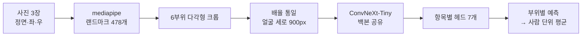

---

## 폴더 구조

로컬 기준이다. `❌` 표시는 **git에 없는 것**이다(용량때문에 제외).

```
skin_analysis_ai/
├── data/                              ❌ 10.7GB  전처리 결과 (AI Hub 원본에서 생성)
│   ├── 01.원천데이터/{사람}/{기기}/{각도}_{부위}.png   ❌  부위 크롭 26,754장
│   ├── 02.정답지데이터/labels_*.csv                ❌  부위별 정답
│   └── index.csv                                  ❌  크롭 목록 + 피부 면적 + 얼굴 크기
├── data_preprocessing/
│   ├── models/*.task, *.tflite        ❌ 19MB    mediapipe 모델 (구글에서 다운로드)
│   ├── face_regions.py                           랜드마크 → 부위 다각형 → 크롭 → 정규화 (공용 모듈)
│   ├── explore_data.ipynb                        ① 분포·이상치·결측 점검
│   ├── face_regions.ipynb                        ② 한 사람으로 부위 분할 확인 (아래 전처리 그림)
│   ├── extract_regions.ipynb                     ③ 전체 사진 → 크롭 저장
│   └── build_labels.ipynb                        ④ 정답 CSV 생성
├── modeling/
│   ├── model.py                                  백본 1개 + 헤드 7개
│   ├── data.py                                   크롭 → 텐서, 부위별 배치
│   ├── train.ipynb                               ⑤ 파라미터 실험 → 최종 학습 → 테스트 비교 → 배포
│   └── outputs/
│       ├── tuning.csv                            하이퍼파라미터 실험 기록 (24개)
│       ├── fold0~4.pt                 ❌ 558MB   5-fold 모델 가중치
│       └── deploy/
│           ├── meta.json                         서버용 입력 규격 + 단위 복원 기준
│           └── skin.onnx, skin.onnx.data  ❌ 112MB  배포용 모델
├── ailabtools/
│   ├── test_ailabtools.ipynb                     상용 API 호출
│   └── test_set/
│       ├── test_subjects_165.json                테스트 165명 목록 (학습에 절대 쓰지 않음)
│       └── raw/                       ❌ 18MB    API 응답 원본
├── docs/images/                                  README 그림
├── .venv/                             ❌ 4GB     가상환경
├── .env                               ❌         API 키
└── requirements.txt
```

AI Hub 원본(`028.한국인_피부상태_측정_데이터`, 43GB)은 로컬에도 두지 않았다. 전처리를 처음부터 다시 할 때만 필요하다.

---

## 1. 전처리

**사진 1장 → 부위 크롭 → 배율을 맞춘 모델 입력**으로 바꾼다. 한 사람(0509, 스마트폰)을 예로 든다.

### ① 랜드마크로 6부위 다각형 잡기

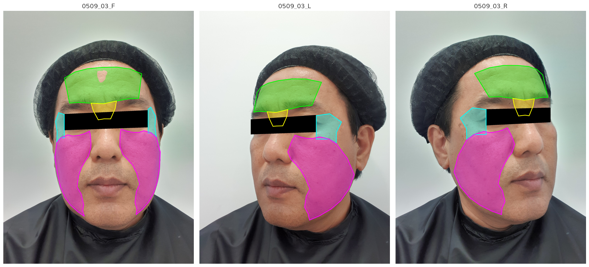

사각형이 아니라 **랜드마크를 이은 다각형**으로 자른다. 사각형으로 자르면 머리카락·배경 같은 부위 밖이 섞인다. 이마의 빈 곳처럼 피부가 아닌 부분은 분할 모델로 한 번 더 뺀다.

### ② 부위별로 자르기 — 정면 6장, 좌측 4장, 우측 4장

**정면**

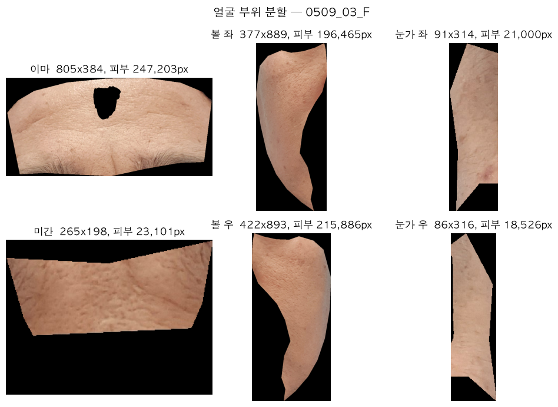

<table>
<tr><th>좌측 (반대쪽 볼·눈가는 가려져서 뺀다)</th><th>우측</th></tr>
<tr>
<td>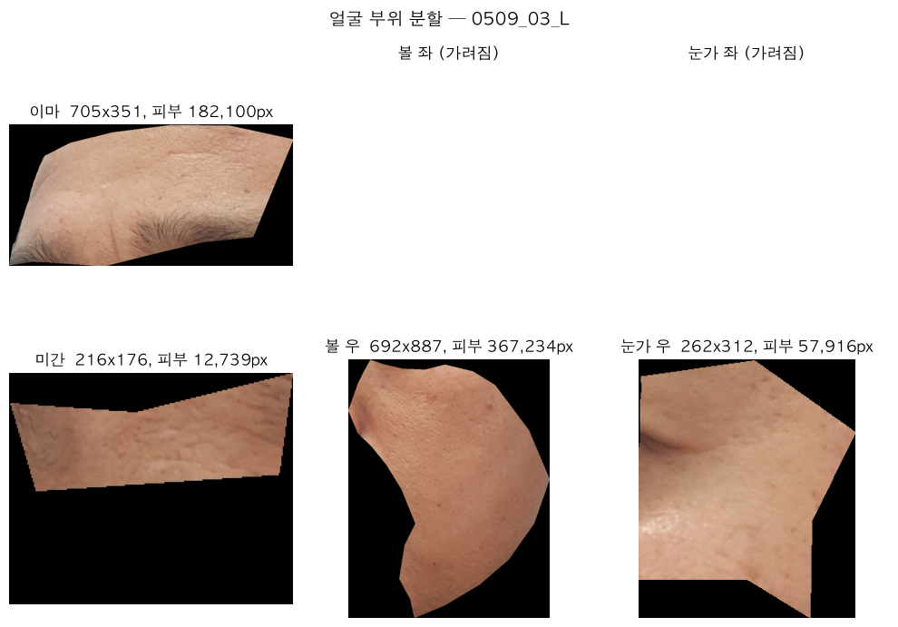</td>
<td>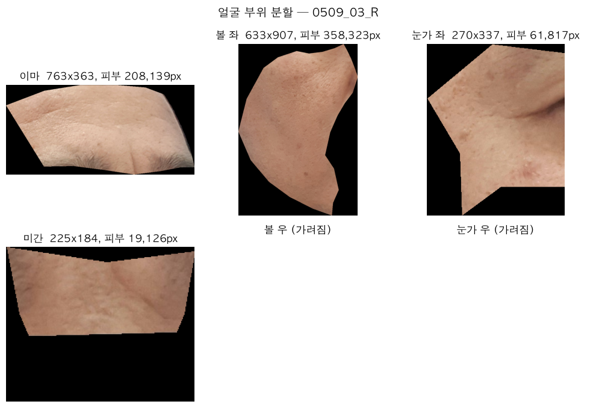</td>
</tr>
</table>

### ③ 배율 통일 → 부위별 캔버스

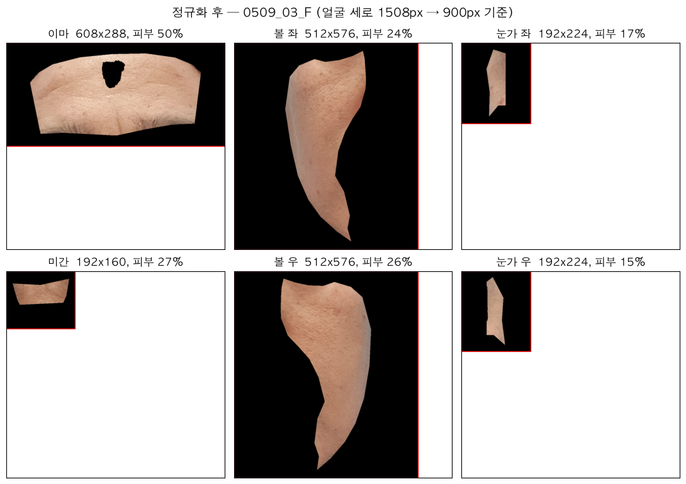

기기·촬영 거리에 따라 얼굴 크기가 최대 4배까지 다르다. 그대로 두면 "모공이 크다"와 "크게 찍혔다"를 구분할 수 없어서 **얼굴 세로 길이를 900px로 맞춘다.** 부위마다 모양이 달라서 입력 크기도 다르게 둔다.

| 부위 | 이마 | 미간 | 눈가 | 볼 |
|---|:-:|:-:|:-:|:-:|
| 모델 입력 (가로×세로) | 608×288 | 192×160 | 192×224 | 512×576 |

### 데이터 규모와 제외 기준

| | 사람 | 사진 | 크롭 |
|---|:-:|:-:|:-:|
| 학습·검증 | 800명 | — | 실험 9,109 (정면) / 최종 17,067 (3각도) |
| 테스트 (ailabtools와 같은 사람) | 165명 | — | 1,894 (정면) |
| 합계 | 965명 | 5,790장 | 26,754장 |

- **디지털카메라 사진 제외**: 검은 배경 + 스튜디오 조명이라 같은 사람도 색이 크게 달라진다(기기 차이 10.8 > 사람 간 차이 7.4).
- **저해상도 57장 제외**: 배율을 맞추려면 3~4배 확대해야 해서 질감이 뭉개진다.
- **피부가 2만 픽셀 미만인 크롭 제외**: 머리카락·안경으로 가려진 경우.

---

## 2. 모델링

### 2-1. 모델 구조

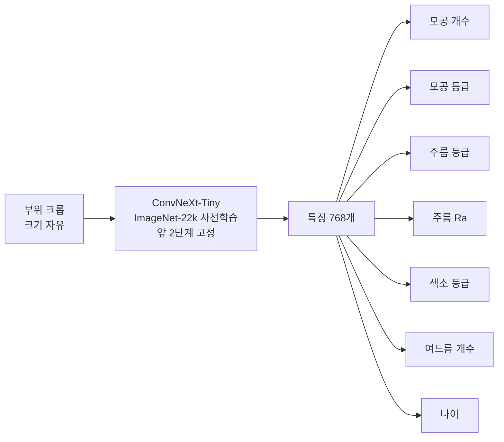

부위마다 정답이 있는 항목이 달라서, **정답이 있는 칸만 손실에 넣는다.**

| | 이마 | 미간 | 눈가 좌/우 | 볼 좌/우 |
|---|:-:|:-:|:-:|:-:|
| 모공 | · | · | · | 등급 + **개수** |
| 주름 | 등급 | 등급 | 등급 + **Ra** | · |
| 색소 | 등급 | · | · | 등급 |
| 여드름 | **개수** | · | · | **개수** |
| 나이 | **나이** | **나이** | **나이** | **나이** |

굵은 글씨는 기기 측정값·실제값, 나머지는 전문가가 매긴 등급이다.

### 2-2. 하이퍼파라미터 결정

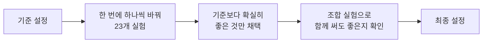

- **조건**: 같은 fold(학습 640명 / 검증 160명), 정면 사진, 최대 15에폭 + 조기 종료(4번 연속 개선 없으면 중단)
- **비교 기준**: 검증 loss. 7개 항목을 같은 비중으로 합친 값이다
- **오차 범위**: seed만 바꿔도 검증 loss가 **약 0.001** 흔들린다 → 이보다 작은 차이는 무시한다

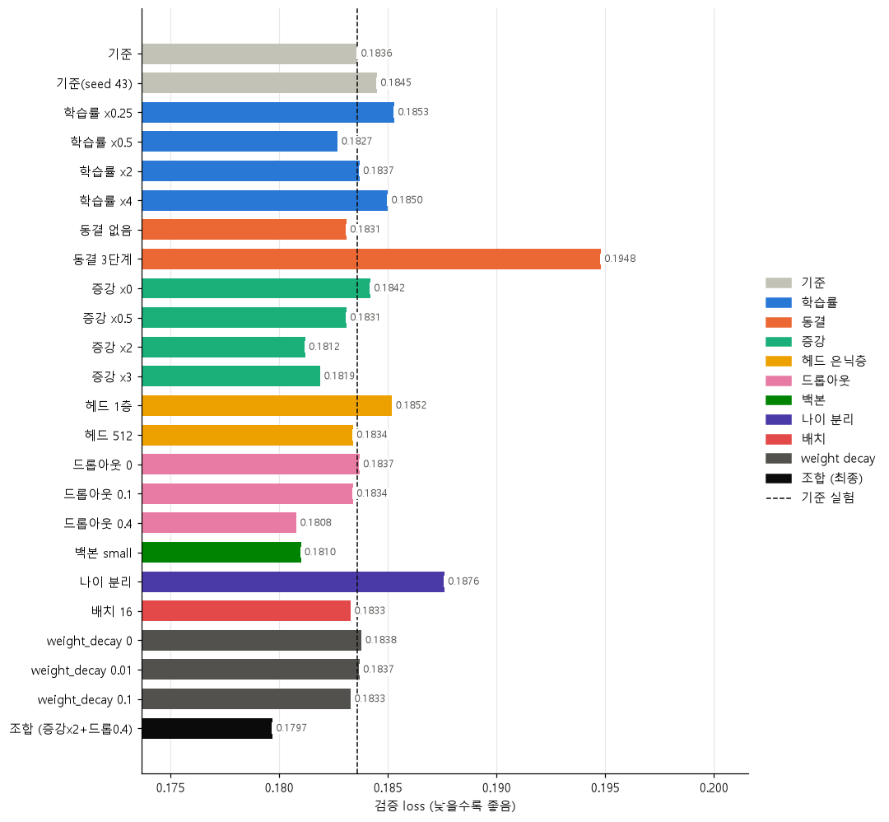

<details>
<summary>항목별 스피어맨 (클릭해서 펼치기)</summary>

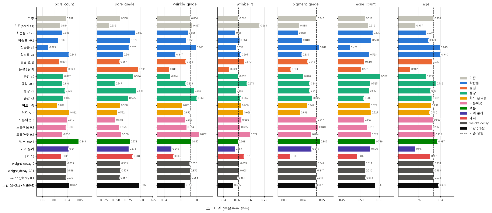

</details>

| 설정 | 기준 | 실험 결과 | 최종 |
|---|:-:|---|:-:|
| 증강 강도 (회전·배율·밝기) | 10° / ±5% / ±10% | ×2가 가장 좋음 (−0.0024) | **×2** |
| 드롭아웃 | 0.2 | 0.4가 가장 좋음 (−0.0028) | **0.4** |
| 학습률 | 2e-5 / 2e-4 | ×0.5 ~ ×2 모두 오차 범위 | 기준 |
| 동결 단계 | 2 | 3단계는 확실히 나쁨 (+0.011) | 기준 |
| 헤드 은닉층 | 256 | 없애면 나쁨, 512는 차이 없음 | 기준 |
| 배치 / weight decay | 8 / 0.05 | 차이 없음 | 기준 |
| 나이 분리 | 안 함 | 나이만 나빠지고 다른 항목은 그대로 | 기준 |
| **조합 (증강×2 + 드롭아웃 0.4)** | | **0.1797 (−0.0039), 전체 1위** | **채택** |

### 2-3. 최종 학습 (5-fold 교차검증)

최종 설정 + **3각도 사진 전부**(크롭 17,067개)로 5개 fold를 학습했다. RTX 5070 기준 약 1.5시간.

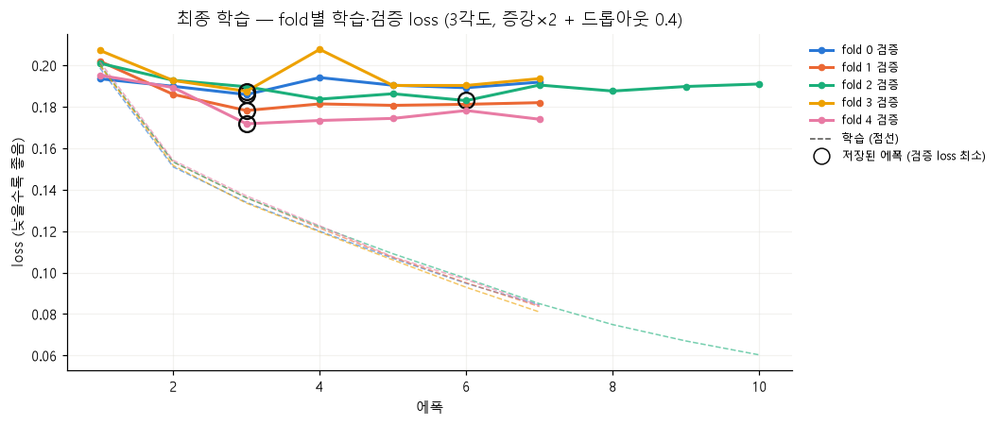

학습 loss는 계속 내려가지만 **검증 loss는 대부분 3에폭에서 바닥**이다. 데이터가 800명뿐이라 과적합이 빨리 온다. 동그라미가 저장된 모델이다.

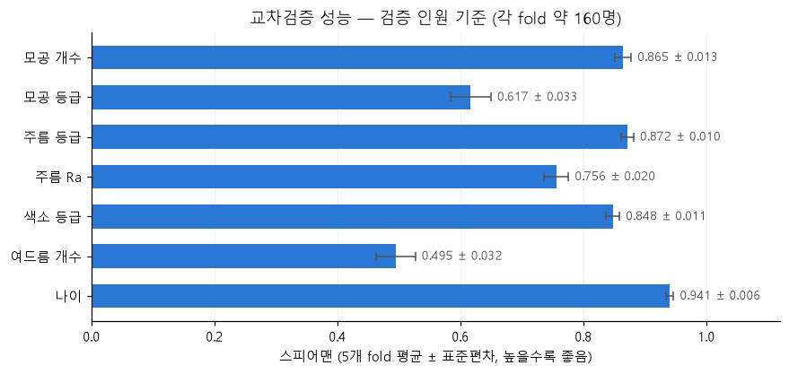

5개 fold의 편차가 작아서(대부분 ±0.02 이내) 어떤 160명으로 검증해도 성능이 비슷하다.

### 2-4. 배포용 내보내기

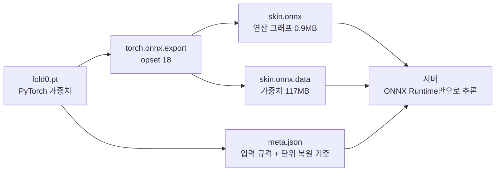

입력 크기를 고정하지 않고 내보내서 **부위마다 다른 크기를 모델 하나로 처리**한다. PyTorch와 결과가 같은지 확인했다.

| 부위 | 입력 크기 | PyTorch와 차이 | 추론 시간 (CPU) |
|---|:-:|:-:|:-:|
| 이마 | 608×288 | 0.000000 | 134ms |
| 미간 | 192×160 | 0.000001 | 20ms |
| 눈가 | 192×224 | 0.000000 | 28ms |
| 볼 | 512×576 | 0.000000 | 230ms |
| **6부위 합계** | | | **0.7초** |

지금은 fold0(640명으로 학습한 모델)을 내보냈다. 실제 서비스라면 800명 전체로 다시 학습한 모델을 쓰는 게 맞다.

---

## 3. 최종 모델 성능

학습·검증에 한 번도 쓰지 않은 **테스트 165명**을 5개 fold 모델의 평균(앙상블)으로 예측했다. ailabtools도 같은 165명을 돌렸다.

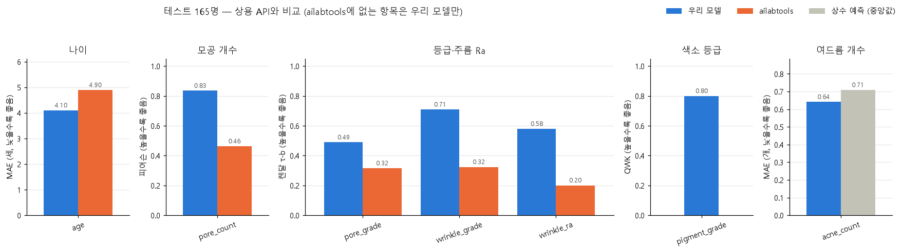

항목 성격에 맞춰 지표를 다르게 썼다.

| 칸 | 지표 | 이유 |
|---|---|---|
| 나이 | MAE | 두 모델 모두 "몇 살"로 단위가 같아서 직접 비교할 수 있다 |
| 모공 개수 | 피어슨 | 연속값. ailabtools는 "확대된 모공"만 세서 정의가 다르지만 직선 관계는 볼 수 있다 |
| 등급·주름 Ra | 켄달 τ-b | ailabtools는 4단계, 정답은 6~7단계라 **순서만** 비교할 수 있다. 동점이 많아서 스피어맨보다 켄달이 맞다 |
| 색소 등급 | QWK | ailabtools에 없어서 우리 모델만. 예측과 정답의 단위가 같아 등급 일치도를 직접 잰다 |
| 여드름 개수 | MAE | 우리 모델만. 회색은 "항상 중앙값을 찍는" 예측 — 이것보다 나아야 의미가 있다 |

| 항목 | 우리 모델 | ailabtools | 해석 |
|---|:-:|:-:|---|
| 나이 | MAE **4.1세** | 4.9세 | 근소하게 앞섬 |
| 모공 개수 | 피어슨 **0.835** | 0.463 | 크게 앞섬 |
| 주름 등급 | 켄달 **0.709** | 0.324 | 두 사람 중 누가 더 심한지 약 85% 맞힘 (ailabtools 66%) |
| 주름 Ra | 켄달 **0.580** | 0.201 | 크게 앞섬 |
| 모공 등급 | 켄달 **0.489** | 0.316 | 앞서지만 정답의 61%가 한 등급에 몰려 있어 둘 다 낮다 |
| 색소 등급 | QWK **0.800** | — | ±1등급 이내로 맞히는 비율 97% |
| 여드름 개수 | MAE 0.64개 | — | 상수 예측(0.71개)보다 10%만 나음 → 사실상 못 맞힘 |

---

## 4. 고민해 봐야 할 문제

### ① 연속형·범주형 항목을 다른 모델로 나눌까

| 지금 | 문제 |
|---|---|
| 등급(0~6)도 연속값으로 회귀한다 | 같은 볼 사진으로 **모공 개수는 0.85**, **모공 등급은 0.60**. 등급은 경계가 모호하고 한 등급에 몰려 있어서 회귀 손실과 잘 맞지 않는다 |
| 7개 항목이 백본 하나를 공유한다 | 성격이 다른 항목끼리 백본을 끌어당길 수 있다 |

- **나누면**: 등급은 순서형 분류(예: CORAL, 누적 확률), 연속형은 회귀로 각자 맞는 손실을 쓴다.
- **대가**: 모델 2개 → 학습·배포 비용 2배. 800명뿐이라 백본을 나누면 항목끼리 도와주는 효과가 사라질 수 있다.
- **먼저 해 볼 것**: 백본은 그대로 두고 **등급 헤드만 분류형으로** 바꿔 비교한다.

### ② 백본을 Tiny → Small로 바꿀까

| | Tiny (지금) | Small |
|---|:-:|:-:|
| 실험 검증 loss | 0.1836 | **0.1810** (−0.0026) |
| 평균 스피어맨 | 0.744 | **0.753** (실험 중 1위) |
| 파라미터 | 2,800만 | 4,900만 (1.8배) |
| 학습·추론 시간 | 기준 | 약 2배 (추정) |
| 배포 모델 크기 | 117MB | 약 200MB (추정) |

- 단독 실험에서는 두 번째로 좋았지만 **조합 설정(증강×2 + 드롭아웃 0.4)과 함께는 시험하지 않았다.**
- 큰 모델은 보통 더 낮은 학습률을 좋아해서, 바꾼다면 학습률 ×0.5 / ×1 정도는 다시 확인해야 한다 (실험 약 40분).

### ③ 여드름 항목을 뺄까

| 근거 | |
|---|---|
| 성능 | 테스트 스피어맨 0.40, MAE가 상수 예측보다 10%만 나음 |
| 정답의 한계 | 대부분 0~1개라 구분할 정보가 적다 |
| 사진 불일치 | 정답은 **디지털카메라 사진의 좌표**로 만들었는데, 학습에는 디지털카메라 사진을 쓰지 않는다 |

- **빼면**: 헤드가 하나 줄고, 여드름 손실이 백본을 흔드는 것을 막는다.
- **대안**: 개수 대신 "없음 / 있음" 두 단계로 바꿔서 보여 준다.

---

<details>
<summary>개발 환경</summary>

| | |
|---|---|
| OS | Windows 11 |
| GPU | RTX 5070 (12GB) — CUDA 12.8 이상 필요 |
| Python | 3.14 |
| 주요 패키지 | torch 2.14 (cu130), timm 1.0, mediapipe 0.10.35, onnxruntime 1.30 |

전체 목록은 `requirements.txt`. Windows에서는 Smart App Control을 끄지 않으면 torch DLL이 차단된다.

</details>
